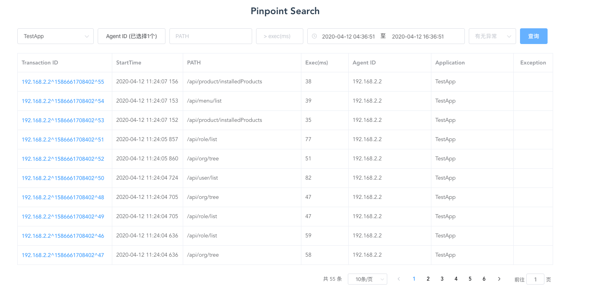
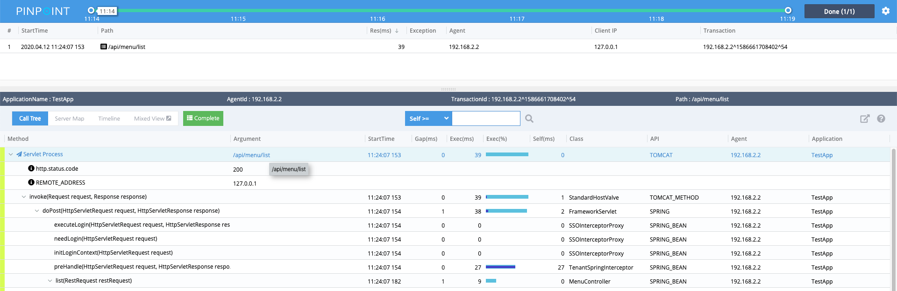
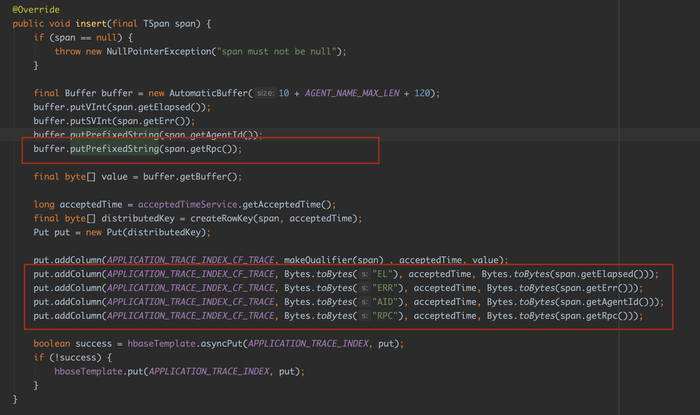
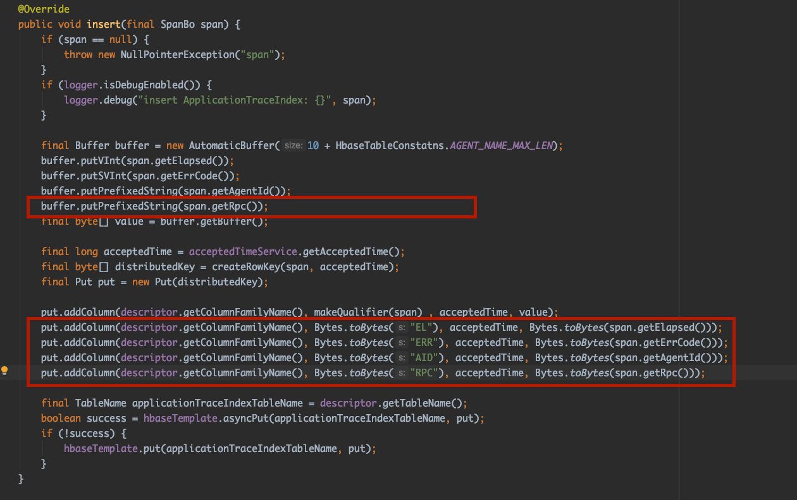
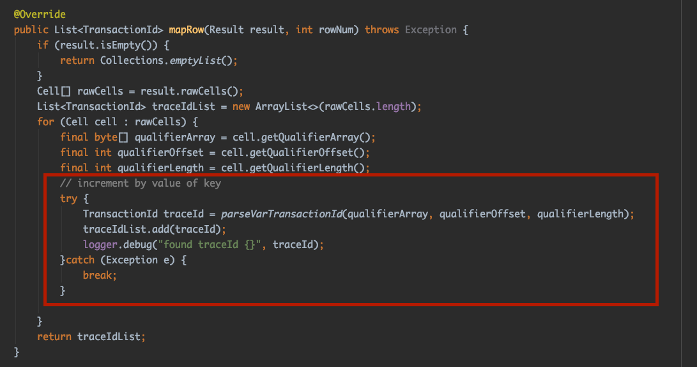

# Pinpoint Search

[中文文档](./README_CN.md)

Expand [pinpoint](https://github.com/naver/pinpoint) query function

Support pinpoint precise search

You can query the request list by **application**, **agent_id**, **request path**, **exec range**, **time range**, **Exception**, as shown in the following figure:

Support to click **Transaction ID** to directly link to pinpoint request.

## Getting Started

### Required

**JDK 8** 

### Config

* Need to configure `hbase.properties` in` pinpoint-search-web` module, same as `pinpoint-web` configuration。

* Need to configure `pinpoint.properties` in` pinpoint-search-web` module

    * `pinpointWebUrl` `pinpointWebUrl` Configure your pinpoint web host address, for example:` http://localhost:9000`
    
    * `history` configure` pinpoint-web` HTML5 History mode, `history = true` Transaction ID url will not have`#` ：`http://localhost:9000/transactionList/TestApp@STAND_ALONE/5m/2020-04-12-11-19-48/192.168.2.2%5E1586661708402%5E54-1586661847211-39`
    
    * `query.limit` Configure the maximum number of queries
    
    * `hbase.num.parallel.threads` configures the number of threads for multi-threaded queries
    
### Run

`mvn clean package -Dmaven.test.skip=true`

Build and generate `pinpoint-search-web-1.0.0-SNAPSHOT.war`

### Before it needs to be modified pinpoint 

In order to support Pinpoint server-side search, a simple modification of Pinpoint is required

1. Modify pinpoint-collector module Class [com.navercorp.pinpoint.collector.dao.hbase.HbaseApplicationTraceIndexDao](https://github.com/naver/pinpoint/blob/master/collector/src/main/java/com/navercorp/pinpoint/collector/dao/hbase/HbaseApplicationTraceIndexDao.java)

Add the code in the red box to the `insert` method, as shown below:

* pinpoint version 1.x.x

* pinpoint version 2.0.x

2. Modify pinpoint-web module Class [com.navercorp.pinpoint.web.mapper.TransactionIdMapper](https://github.com/naver/pinpoint/blob/master/web/src/main/java/com/navercorp/pinpoint/web/mapper/TransactionIdMapper.java)

Modify the red box in the `mapRow` method and add exception handling

3. Modify pinpoint-web module Class [com.navercorp.pinpoint.web.mapper.TraceIndexScatterMapper3](https://github.com/naver/pinpoint/blob/master/web/src/main/java/com/navercorp/pinpoint/web/mapper/TraceIndexScatterMapper3.java)

Modify the red box in the `mapRow` method and add exception handling

 * Class [com.navercorp.pinpoint.web.mapper.TraceIndexScatterMapper2](https://github.com/naver/pinpoint/blob/master/web/src/main/java/com/navercorp/pinpoint/web/mapper/TraceIndexScatterMapper2.java)
 * Class [com.navercorp.pinpoint.web.mapper.TraceIndexScatterMapper](https://github.com/naver/pinpoint/blob/master/web/src/main/java/com/navercorp/pinpoint/web/mapper/TraceIndexScatterMapper.java)
 
 Do the same
 
4. In `pinpoint` project recompile` pinpoint-web` and `pinpoint-collector` two modules
 
 `mvn clean package -Dmaven.test.skip=true -pl web -am`
 
 `mvn clean package -Dmaven.test.skip=true -pl collector -am`

## Compatibility

pinpoint1.6.x - pinpoint2.0.x

## License

Apache License

## Community

github issues

QQ Group : 1045635366

