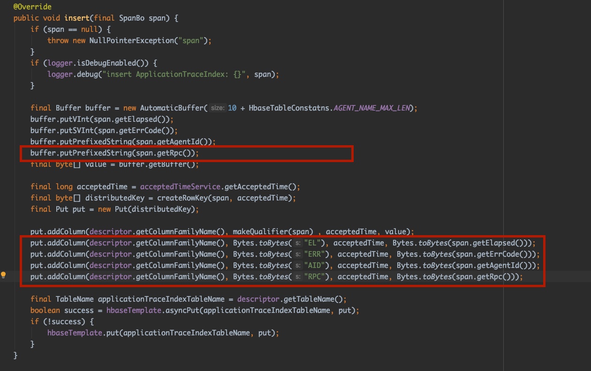
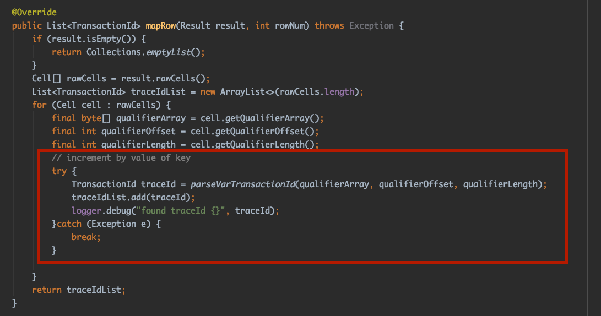
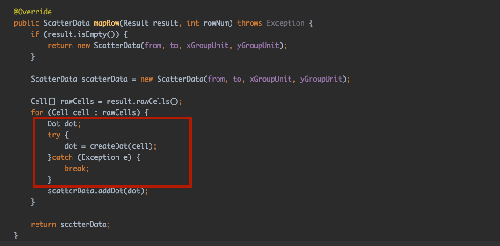

# Pinpoint Search

扩展 [pinpoint](https://github.com/naver/pinpoint) 查询功能

支持pinpoint精确查询功能

你可以通过配置 **application**, **agent_id**, **request path**, **exec range**, **time range**, **Exception**条件来过滤pinpoint请求，如下图所示：

Support to click **Transaction ID** to directly link to pinpoint request.

支持点击**Transaction ID**直接链接到pinpoint请求，如下图所示

## Getting Started

### 需要

**JDK 8**及以上

### 配置

* 需要配置`pinpoint-search-web`模块的`hbase.properties`文件，配置项同`pinpoint`项目的`pinpoint-web`的配置项

* 需要配置`pinpoint-search-web`模块的`pinpoint.properties`文件，以下是该文件的配置项信息：

    * `pinpointWebUrl` 配置你的pinpoint项目web的地址, 例如:` http://localhost:9000`
    
    * `history`  配置链接到pinpoint请求时地址中的HTML5 History 模式, `history = true` Transaction ID url不含有`#`，例如：`http://localhost:9000/transactionList/TestApp@STAND_ALONE/5m/2020-04-12-11-19-48/192.168.2.2%5E1586661708402%5E54-1586661847211-39`
    
    * `query.limit` 配置最大查询个数
    
    * `hbase.num.parallel.threads` 配置查询请求时并发线程数
    
### 运行

`mvn clean package -Dmaven.test.skip=true`

构建并生成 `pinpoint-search-web-1.0.0-SNAPSHOT.war`

配置到tomcat等Server中启动即可运行

### 改造pinpoint项目 

为了支持`pinpoint HBase` 支持服务端查询，需要对原`pinpoint`项目进行简单改造

1. 修改 pinpoint-collector 模块中的 [com.navercorp.pinpoint.collector.dao.hbase.HbaseApplicationTraceIndexDao](https://github.com/naver/pinpoint/blob/master/collector/src/main/java/com/navercorp/pinpoint/collector/dao/hbase/HbaseApplicationTraceIndexDao.java) 类 

在 `insert` 方法中添加下图红框中的代码：

* pinpoint version 1.x.x

* pinpoint version 2.0.x

2. 修改 pinpoint-web 模块中的 [com.navercorp.pinpoint.web.mapper.TransactionIdMapper](https://github.com/naver/pinpoint/blob/master/web/src/main/java/com/navercorp/pinpoint/web/mapper/TransactionIdMapper.java) 类 

在`mapRow`方法中修改下图红框中的逻辑，主要是添加了对异常的处理

3. 修改 pinpoint-web 模块中的 [com.navercorp.pinpoint.web.mapper.TraceIndexScatterMapper3](https://github.com/naver/pinpoint/blob/master/web/src/main/java/com/navercorp/pinpoint/web/mapper/TraceIndexScatterMapper3.java) 类

在`mapRow`方法中修改下图红框中的逻辑，主要是添加了对异常的处理

 * Class [com.navercorp.pinpoint.web.mapper.TraceIndexScatterMapper2](https://github.com/naver/pinpoint/blob/master/web/src/main/java/com/navercorp/pinpoint/web/mapper/TraceIndexScatterMapper2.java)
 * Class [com.navercorp.pinpoint.web.mapper.TraceIndexScatterMapper](https://github.com/naver/pinpoint/blob/master/web/src/main/java/com/navercorp/pinpoint/web/mapper/TraceIndexScatterMapper.java)
 
同样处理
 
4. 重新编译`pinpoint`项目的 ` pinpoint-web` 和 `pinpoint-collector` 两个模块
 
 `mvn clean package -Dmaven.test.skip=true -pl web -am`
 
 `mvn clean package -Dmaven.test.skip=true -pl collector -am`

## 兼容性

兼容 pinpoint 1.6.x 至 2.0.x版本

## License

Apache License

## Community

github issues

QQ群 : 1045635366

